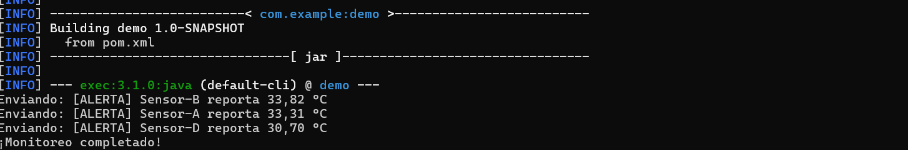

# Proyecto Programación Reactiva - Monitoreo de Temperatura con RxJava

## Trabajado por Mariana Valle Moreno

---

## Descripción General

Este proyecto consistió en la creación de un sistema de monitoreo de sensores de temperatura utilizando programación reactiva con RxJava. La solución propuesta simula lecturas de varios sensores, combinando flujos de datos y generando alertas cuando se detectan temperaturas por encima de un umbral, en este caso 30 °C. Las alertas son procesadas y enviadas de forma asíncrona, replicando el comportamiento de un sistema gestionado con operadores reactivos en tiempo real.

Durante el desarrollo del taller, se aprendió a utilizar los operadores fundamentales de RxJava como map, filter, flatMap, merge y zip. Además, se comprendió cómo cada uno transforma y coordina flujos de datos, y cómo combinarlos para construir una lógica robusta y eficiente. En general, esta experiencia me permitió consolidar los conceptos de programación reactiva y comprender su aplicabilidad en escenarios como sistemas IoT, para lecturas de sensores, y procesamiento continuo de datos.

---
## Resultados

